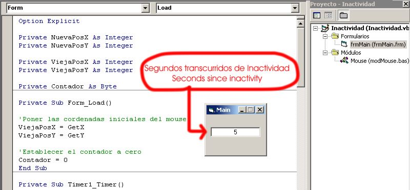

<div align="center">

## Detect inactivity of the Desktop \- Spanish: Detectar la inactividad del Sistema Globalmente


</div>

### Description

Fijarse la cantidad de Segundos de Inactividad del teclado y mouse de todo el sistema (no solo de la app.)
 
### More Info
 
Se fija si presionas alguna tecla, haces click con el mouse, o lo moves...

Utiliza APIs

Segundos transcurridos desde la inactividad

Creo que ninguno


<span>             |<span>
---                |---
**Submitted On**   |2006-07-24 14:40:02
**By**             |[Ivan Serdoch](https://github.com/Planet-Source-Code/PSCIndex/blob/master/ByAuthor/ivan-serdoch.md)
**Level**          |Beginner
**User Rating**    |5.0 (10 globes from 2 users)
**Compatibility**  |VB 5\.0, VB 6\.0
**Category**       |[Coding Standards](https://github.com/Planet-Source-Code/PSCIndex/blob/master/ByCategory/coding-standards__1-43.md)
**World**          |[Visual Basic](https://github.com/Planet-Source-Code/PSCIndex/blob/master/ByWorld/visual-basic.md)
**Archive File**   |[Detect\_ina2008507242006\.zip](https://github.com/Planet-Source-Code/ivan-serdoch-detect-inactivity-of-the-desktop-spanish-detectar-la-inactividad-del-sistema-__1-66065/archive/master.zip)

### API Declarations

```
'Funciones API que se utilizan:
Public Declare Function GetCursorPos Lib "user32" (lpPoint As POINTAPI) As Long
Public Declare Function GetAsyncKeyState Lib "user32" (ByVal vKey As Long) As Integer
Public Const VK_LBUTTON = &amp;H1 'Boton izquierdo del Mouse
Public Const VK_RBUTTON = &amp;H2 'Boton derecho del Mouse
Public Const VK_MBUTTON = &amp;H4 'Boton central del Mouse (Generalmente la Ruedita o scroll)
Public Type POINTAPI
  x As Long 'Coordenada X de la posicion del Mouse
  y As Long 'Coordenada Y de la posicion del Mouse
  End Type
```


